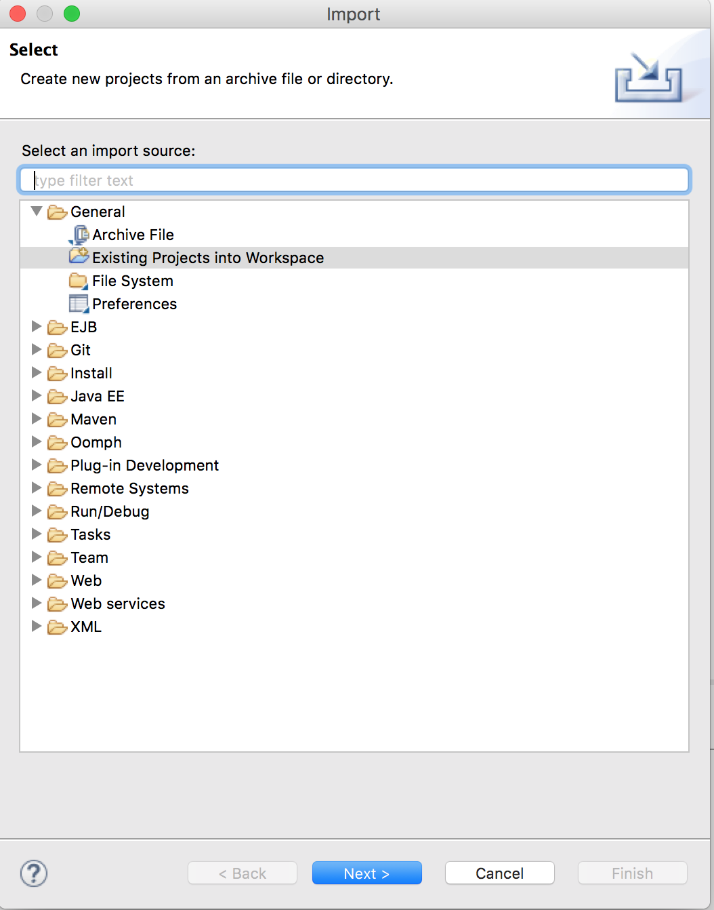
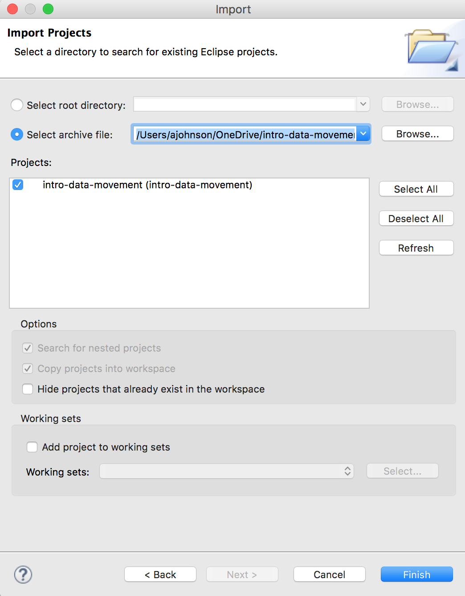

# Introduction to the Data Movement SDK
Here you'll find the supporting code and examples for the Introduction to the Data Movement SDK training tutorial.  Some basic familiarity with MarkLogic Server is assumed.

## Getting Started

1. Download MarkLogic:  
	* http://developer.marklogic.com
 
2. Install, start, and initialize MarkLogic on your local machine:  
	* http://docs.marklogic.com/guide/installation

## Setup the Database for the Examples
With MarkLogic Server setup and running, there are no special database requirements. The tutorial uses the **Documents** database for the code examples. 

## Java Code examples
The demonstrations of the Data Movement SDK are in several formats. The following folders contain these examples.

1. `java-source`  
	* `DataMovementQueryBatcherApp.java` - Java source code demonstrating a Query Batcher job. The code illustrates getting connections to a REST instance with the Java API, starting a Data Movement SDK job and creating a QueryBatcher to delete documents from the MarkLogic Documents database. The file can be opened in any text editor.  
	* `DataMovementWriteBatcherApp.java` - Java source code demonstrating a Write Batcher job. The code illustrates getting connections to a REST instance with the Java API, starting a Data Movement SDK job and creating a WriteBatcher to write socialmedia content from a directory to the MarkLogic Documents database. The file can be opened in any text editor. 
2. `jars` - contains runnable demonstrations from the above source code.  
	* `query-batcher` - Delete the content loaded to the Documents database after running the write-batcher example. To run this example, do the following.  
		1. You will need Java 1.8+ installed and working.
		2. Open a command prompt and change to the `query-batcher` folder.
		3. Edit the `config.properties` file with the following:
			* `host` - default value is MarkLogic running on your localhost.
			* `port` - default value is the App Services MarkLogic application server. This should be left at the default value.
			* `username` - set this value to a MarkLogic user with the admin Role or a MarkLogic username that has read and update permissions to the content in the Documents database.
			* `password` - set this value to the password for the username.
			* `batchsize` - default value deletes 2500 documents per batch of work. This can be modifed, however, the default value has been tested and performs as expected. 
		4. On a command line, type `java -jar dmQuery.jar` then press ENTER. Messages will be printed to the console window showing progress.
	* `write-batcher` - Writes content from the socialmedia folder to the Documents database. To run this example, do the following.
		1. You will need Java 1.8+ installed and working.
		2. Open a command prompt and change to the `write-batcher` folder.
		3. Edit the `config.properties` file with the following:
			* `host` - default value is MarkLogic running on your localhost.
			* `port` - default value is the App Services MarkLogic application server. This should be left at the default value.
			* `username` - set this value to a MarkLogic user with the admin Role or a MarkLogic username that has insert and update permissions to the content in the Documents database.
			* `password` - set this value to the password for the username.
			* `batchsize` - default value deletes 50 documents per batch of work. This can be modifed, however, the default value has been tested and performs as expected. 
			* `threads` - default value of 20 threads for the Write Batcher job. This can be modifed, however, the default value has been tested and performs as expected.
			* `contentpath` - default value points to the `socialmedia` folder in the current `write-batcher` folder.
		4. On a command line, type `java -jar dmWrite.jar` then press ENTER. Messages will be printed to the console window showing progress.
* `eclipse` - This folder contains an Eclipse project archive. The project archive can be imported into Eclipse by doing the following steps.
	1. In Eclipse, go to the **File** menu then **Import...**
	2. Under **General**, select **Existing Projects into Workspace**, as in the following screenshot.  
	
		  
		
	3. Select the archive file `intro-data-movement.zip` in the `eclipse` folder, similar to the screenshot below.  
		  
	4. Click the **Finish** button.
